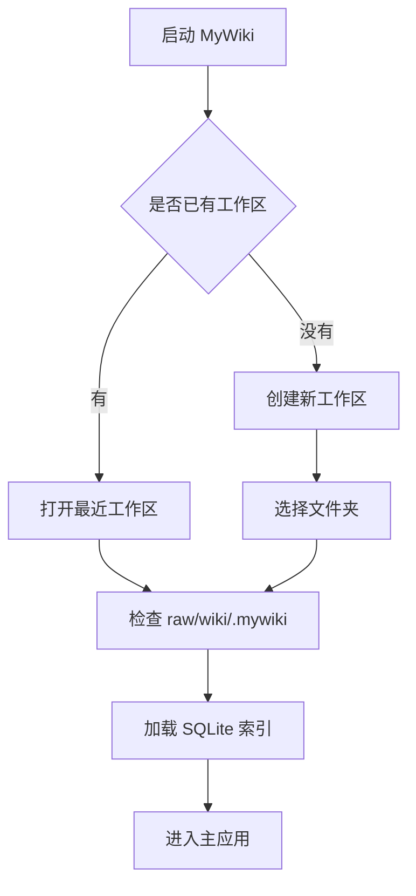
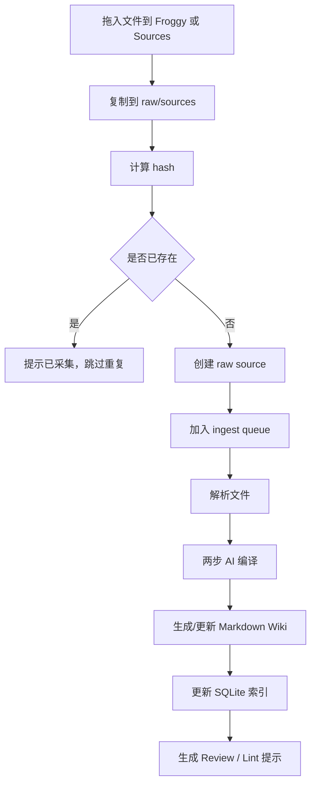
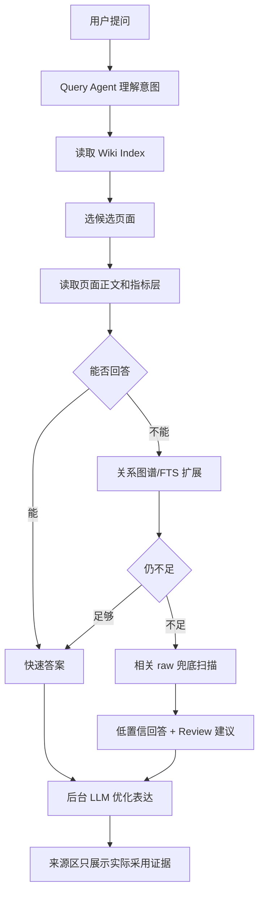
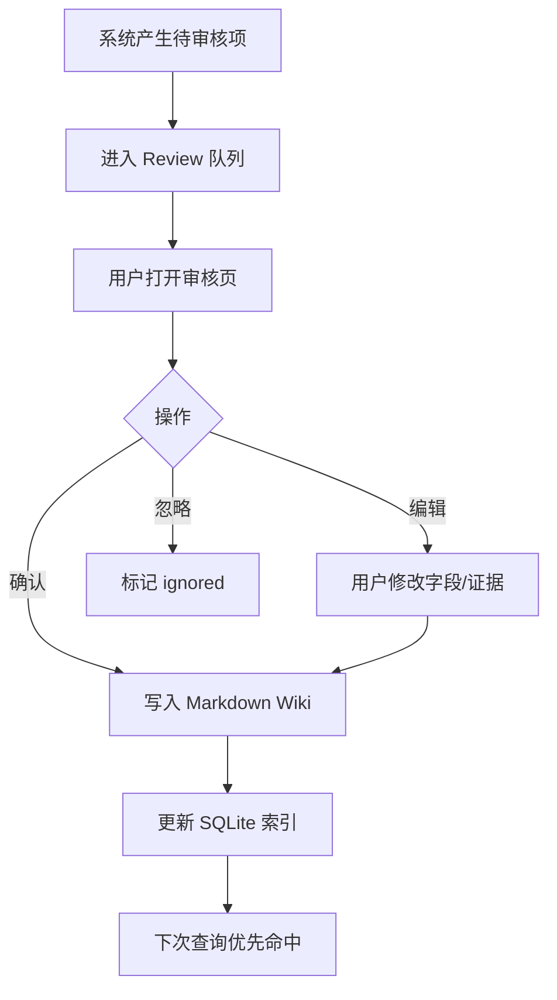
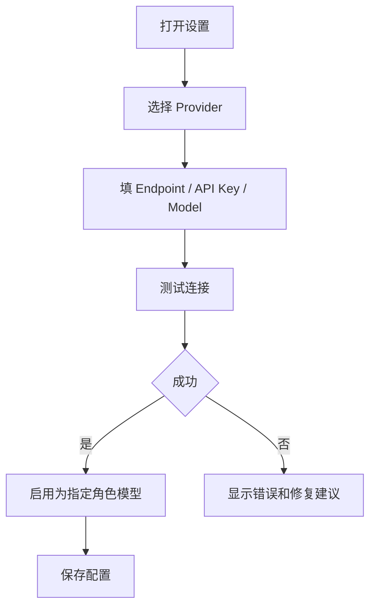

# MyWiki 项目文档 v2.0

更新时间：2026-05-08

## 0. 文档定位

本文档用于定义 MyWiki v2.0 的重构方向、产品目标、功能模块、运行流程、用户交互逻辑、实施计划和测试验收标准。

v2.0 的核心目标不是继续在当前 MVP 上叠加补丁，而是把 MyWiki 从“浏览器 IndexedDB 原型”重构为一个真正可长期使用、可迁移、可追溯、可扩展的个人 AI Wiki 系统。

本文档重度参考本地项目 `D:\llm-wiki` 的产品结构和运行机制，同时保留 MyWiki 已经形成的低摩擦捕获入口、Froggy 桌面壳、关系图谱、待编译回 Wiki 等方向。

## 1. v2.0 一句话定义

MyWiki v2.0 是一个本地优先的个人 AI 知识中枢：用户把各种原始材料丢进 Raw Inbox，系统异步编译成可阅读、可引用、可查询、可演化的 Markdown Wiki，并通过可切换的 LLM Provider、关系图谱、审查队列和桌面 Froggy 捕获入口形成持续增长的知识工作台。

## 2. v2.0 核心判断

### 2.1 当前 MVP 暴露的问题

1. 桌面壳和浏览器使用不同 IndexedDB 存储空间，导致同一套前端代码在不同容器里看到不同知识库。
2. 当前知识主要存为 IndexedDB 结构化对象，长期迁移、备份、人工编辑和跨工具使用都不够自然。
3. 查询层承载了过多“临时推理”和“原文兜底抽取”，容易在面积、收入、人数、时间等具体事实问题上反复出错。
4. 文件捕获已经接近 Karpathy 的 raw 思路，但编译结果还不是稳定的 Wiki 页面，查询时仍会频繁回到原始材料里“现场找答案”。
5. LLM 模型配置仍偏开发者环境变量，不够产品化，普通用户无法在 UI 中自行切换模型、填 API Key、设置上下文窗口。
6. Wiki 页面展示形态不够像一个真正的知识库，缺少 `frontmatter + 正文 + 来源 + 关联 + 右侧预览` 这种长期可维护结构。

### 2.2 v2.0 的根本转向

v2.0 的根本转向是：

从：

```text
捕获材料 -> IndexedDB 结构化提取 -> 查询时再拼接实体/关系/原文 -> LLM 临场回答
```

转为：

```text
Raw Inbox -> 异步 AI 编译 -> Markdown Wiki 页面 + SQLite 索引 -> 查询时读取 Wiki 页面 -> LLM 轻量表达
```

也就是把昂贵、复杂、容易出错的“理解和编译”尽量前移到摄入阶段；查询阶段优先读已经编译好的 Wiki 页面，而不是每次都去原始材料里重新猜。

### 2.3 v2.0 必须守住的产品原则

1. 结构简单高效：在优先保证功能和性能的基础上，设计尽量直接、可解释、不冗杂。
2. 编译优先：原始材料不是最终知识，Wiki 页面才是长期知识资产。
3. 本地优先：用户数据归用户所有，默认落在本地工作区，可备份、可迁移、可用其他 Markdown 工具打开。
4. AI 是编译器和表达层，不是最终裁判：低置信事实必须进入审核队列，用户确认后才能污染 Wiki。
5. Raw 和 Wiki 解耦：采集成功不等于编译成功。文件先安全进入 Raw Inbox，AI 编译可以异步、失败、重试、人工修正。
6. 查询不猜事实：事实型问题优先读已编译页面和指标层，旧材料兜底只能产生“待确认建议”，不能自动写入。
7. 模块化开发：每个模块完成后测试通过并设置回滚点，再进入下一个模块。
8. 成熟工具优先：PDF、Word、Excel、图片、Markdown、HTML 等格式解析优先使用成熟库或模型能力。
9. 复杂任务用分工 Agent：摄入、查询、图谱洞察、Lint、深度研究等复杂任务按职责拆分，不混成一个超大提示词。
10. 可复用实现优先：开发 v2.0 每个模块前，先检查 `D:\llm-wiki` 是否已有可直接复用的产品设计、代码实现、提示词、测试用例或交互细节；在许可证和本地授权允许的前提下，可以直接复制、改造或接入，避免重复造轮子。

## 3. v2.0 产品形态

### 3.1 主应用形态

主应用采用类似 `D:\llm-wiki` 的知识工作台布局：

```text
左侧窄导航栏
  Wiki / Sources / Search / Graph / Review / Lint / Research / Settings

左侧知识树
  Overview
  Entities
  Concepts
  Projects
  Sources
  Queries
  Synthesis

中间工作区
  Sources 列表 / 查询结果 / 图谱 / 审核队列 / 设置页

右侧 Wiki 预览区
  当前选中页面的 metadata card + Markdown 正文
```

### 3.2 桌面入口形态

桌面入口保留 Froggy Capture，定位是“极低摩擦捕获入口”，不是完整知识库界面。

Froggy 桌面壳只负责：

1. 拖拽文件、粘贴图片、粘贴文本、投喂网页剪藏。
2. 把材料写入统一 Raw Inbox。
3. 显示轻量队列状态和失败提示。
4. 必要时一键打开主应用。

Froggy 不应该拥有独立知识库，也不应该和浏览器版本维护两套数据库。

### 3.3 数据资产形态

用户最终拥有的是一个本地 Wiki 工作区：

```text
MyWiki Workspace/
  raw/
    sources/
    assets/
  wiki/
    index.md
    overview.md
    log.md
    entities/
    concepts/
    projects/
    sources/
    queries/
    synthesis/
    decisions/
    meetings/
  .mywiki/
    mywiki.sqlite
    ingest-queue.json
    ingest-cache.json
    review.json
    settings.json
    locks/
```

其中：

1. `raw/` 保存原始材料，用户和系统都可以追加。
2. `wiki/` 保存可读、可编辑、可迁移的 Markdown 页面。
3. `.mywiki/` 保存应用索引、队列、缓存、配置等运行状态。

原则上，`wiki/` 是知识资产，`.mywiki/` 是应用状态。用户迁移时至少需要保留 `raw/` 和 `wiki/`。

## 4. 数据架构

### 4.1 存储分层

v2.0 采用三层存储：

1. 文件层：`raw/` 和 `wiki/`，保存用户长期资产。
2. 索引层：SQLite，保存页面索引、全文索引、图谱边、任务、审核项、队列状态。
3. 缓存层：编译缓存、查询缓存、向量缓存、图布局缓存，可重建。

### 4.2 为什么要替代 IndexedDB 作为主数据层

IndexedDB 适合 Web 原型，但不适合作为 MyWiki v2.0 的唯一数据源：

1. 浏览器和 Tauri WebView 的 IndexedDB 存储空间天然隔离。
2. 用户很难直接备份、查看、修复 IndexedDB 内的数据。
3. 多设备迁移、导出、版本控制、Markdown 工具兼容都不自然。
4. 桌面壳和主应用难以共享同一份 IndexedDB。

v2.0 中 IndexedDB 仅允许作为临时缓存或 Web-only 预览层，不再作为主知识库。

### 4.3 SQLite 的职责

SQLite 不替代 Markdown，而是作为本地索引和运行状态数据库。

主要表：

```text
pages
  id, slug, path, type, title, summary, tags, related, sources, updatedAt, hash

raw_sources
  id, path, filename, mediaType, hash, status, createdAt, parsedTextPath

relationships
  id, sourcePageId, targetPageId, relationType, weight, evidence, sourceIds

tasks
  id, title, owner, status, dueAt, sourcePageId, evidence

indicators
  id, pageId, categoryName, businessLine, name, value, unit, rawValue, confidence, sourceQuote, sourceId

reviews
  id, kind, title, description, pages, evidence, options, status

ingest_jobs
  id, rawSourceId, status, progress, stage, retryCount, error

query_cache
  id, normalizedQuestion, answerPageId, evidencePageIds, createdAt

provider_configs
  id, provider, apiMode, endpoint, apiKeyRef, model, contextWindow, enabled, role
```

### 4.4 Markdown 页面 frontmatter

所有 Wiki 页面必须有 frontmatter。

基础格式：

```yaml
---
type: entity | concept | project | source | query | synthesis | decision | meeting | overview
title: 页面标题
slug: page-slug
created: 2026-05-08
updated: 2026-05-08
tags: []
related: []
sources: []
status: active
---
```

项目类页面可扩展：

```yaml
categories:
  - name: 医疗业态
    aliases: [医疗板块, 医疗方面]
    items: []
  - name: 住宅业态
    aliases: [住宅板块, 康养住宅]
    items: []
indicators:
  - name: 建筑面积
    categoryName: 住宅业态
    value: null
    unit: null
    rawValue: null
    confidence: not-found
    source: null
```

### 4.5 Markdown 正文结构

每个 Wiki 页面不只是字段集合，而是一篇可读文档。

推荐结构：

```markdown
# 页面标题

## 摘要

用 2-5 句话讲清楚这个页面是什么、为什么重要、当前状态。

## 关键事实

- 事实 1
- 事实 2

## 分类结构

按项目、业态、主题或角色拆分内部结构。

## 指标与证据

表格列出面积、收入、投资额、时间、人数等事实指标。

## 关联页面

- [[相关页面]]

## 来源

- [[source-page]]
```

### 4.6 关系和指标的联动规则

1. `categories[].name` 是维度名，例如“医疗业态”“住宅业态”“智算中心”。
2. `indicators[].categoryName` 必须能匹配某个 category 的 `name` 或 `aliases`。
3. 如果指标属于整体项目，`categoryName` 可为空或为“整体”。
4. 查询“某项目某业态某指标”时，必须先解析到 `page + category + indicator`，再取值。
5. 如果该指标明确为 `not-found`，直接回答“已编译 Wiki 中未找到”，不再临时从 OCR 噪声里猜。
6. 从原文兜底扫描出的疑似指标，只能进入 review，不可自动写入正式指标层。

## 5. 核心功能模块

### 5.1 Workspace 管理模块

目标：统一桌面壳和主应用的数据入口，彻底解决两套 IndexedDB 的问题。

功能：

1. 创建工作区。
2. 打开已有工作区。
3. 记录最近工作区。
4. 检查工作区完整性。
5. 迁移旧 IndexedDB 数据到文件系统 Wiki。
6. 备份与恢复。

用户交互：

```text
首次启动
  -> 选择“创建新知识库”或“打开已有知识库”
  -> 选择本地文件夹
  -> 系统创建 raw/wiki/.mywiki
  -> 进入主应用
```

### 5.2 Raw Inbox 模块

目标：让用户不再手动转换格式。

支持格式：

1. 文本：`.md`, `.txt`, `.html`, `.csv`, `.json`
2. 文档：`.docx`, `.pdf`
3. 表格：`.xlsx`, `.xls`, `.csv`
4. 图片：`.png`, `.jpg`, `.jpeg`, `.webp`
5. 网页保存材料：`.html` + assets

运行流程：

```text
用户拖入文件
  -> 文件复制到 raw/sources
  -> 生成 raw_sources 记录
  -> 计算 SHA256
  -> 如果 hash 已存在，提示已采集
  -> 如果新文件，加入 ingest_jobs
  -> UI 显示“已采集/待编译”
```

交互原则：

1. “采集成功”和“编译成功”分开显示。
2. 文件进入 Raw Inbox 后不应因为 AI 失败而丢失。
3. 队列中显示总数、当前处理项、阶段、百分比、失败原因、重试入口。

### 5.3 Froggy Capture 桌面入口

目标：把捕获动作压缩成一步，把等待处理变成轻量情感反馈。

核心交互：

```text
桌面常驻青蛙小窗
  -> 用户拖文件到青蛙区域
  -> 青蛙张嘴/咀嚼动效
  -> 文件进入 Raw Inbox
  -> 气泡提示“我先收下，后台慢慢消化”
  -> 队列状态默认折叠，可展开查看
```

UI 约束：

1. 桌面壳默认只显示青蛙和投喂区域。
2. 状态、队列、自动编译开关默认折叠。
3. 气泡文字不改变窗体尺寸，不挤压布局。
4. 背景透明，窗口不干扰桌面工作。
5. 失败时用轻提示，不弹打断式大窗口。

### 5.4 文件解析模块

目标：把不同格式统一转为可编译文本和附件引用。

解析策略：

1. Markdown/Text/CSV：直接读取。
2. Word：用成熟库提取正文、标题、表格。
3. Excel：按 sheet 转 Markdown 表格，并保留工作表名。
4. PDF：先提取文本；如果文本质量差，则提取页面图片并交给 vision 模型。
5. 图片：优先交给 vision 模型理解；OCR 仅作为辅助，不强制单独 OCR。
6. HTML：清理导航、脚本和样式，保留正文、标题、链接。

输出结构：

```text
parsed/
  source-id/
    text.md
    images/
    tables/
    metadata.json
```

### 5.5 异步摄入队列模块

目标：把用户捕获时间和 AI 编译时间解耦。

参考 `D:\llm-wiki` 的队列机制：

1. 队列持久化到 `.mywiki/ingest-queue.json` 或 SQLite。
2. 单工作区默认串行处理，避免并发写 Wiki 产生冲突。
3. 每个 job 有 `pending / parsing / analyzing / generating / writing / done / failed / canceled` 状态。
4. 每个 await 后检查当前 workspace 是否仍一致，避免写错项目。
5. 失败自动重试，重试上限默认 3 次。
6. 用户可暂停、重试、取消。
7. 队列排空后触发 review sweep。

### 5.6 两步式 AI 摄入编译器

目标：避免长文本一次性输出严格 JSON 造成失败。

v2.0 编译使用两步：

```text
Step 1: Analyze
  LLM 读材料和已有 Wiki 索引
  输出结构化分析
  包括关键实体、概念、主张、证据、冲突、建议更新页面

Step 2: Generate
  LLM 基于 Step 1 和材料片段生成 Markdown FILE blocks
  每个 block 是一个 Wiki 页面
  页面包含 frontmatter + 正文
```

长文档策略：

1. 小于 5000 字：直接两步编译。
2. 5000 到 15000 字：先 Markdown 摘要，再结构化分析。
3. 大于 15000 字：按标题、段落、表格边界分块；分块分析后合并。
4. PDF/Excel 等表格型材料必须保留表格语境，不能只抽零散数字。

禁止事项：

1. 禁止让 LLM 一次性对长 PDF 输出完整严格 JSON。
2. 禁止把目录页码、章节编号、表格序号误当事实指标。
3. 禁止无来源地写入具体数字。
4. 禁止低置信事实自动进入正式 Wiki。

### 5.7 Wiki 页面生成与更新模块

目标：让每次摄入都沉淀为可读页面，而不是只增加标签和实体点。

更新策略：

1. 新主题生成新页面。
2. 已存在页面增量更新正文段落、来源、相关页面。
3. 重要冲突生成 review，不直接覆盖旧结论。
4. 查询产生的高价值答案可保存为 `wiki/queries/` 或 `wiki/synthesis/` 页面。
5. 自动更新 `wiki/index.md`、`wiki/log.md` 和 SQLite 索引。

安全规则：

1. LLM 输出文件路径必须通过白名单校验。
2. 只能写入 `wiki/` 目录。
3. 不允许 `..`、绝对路径、控制字符、Windows 盘符绕过。
4. 写入前做 dry-run，展示将要新增或更新的页面。

### 5.8 LLM Provider 设置模块

目标：普通用户能在 UI 中自行配置和切换模型。

参考 `D:\llm-wiki` 的设置页，提供 Provider 列表：

1. OpenAI
2. Anthropic
3. Gemini
4. DeepSeek
5. MiniMax Global
6. MiniMax 中国
7. Kimi / Moonshot
8. 智谱 GLM
9. Groq
10. xAI
11. NVIDIA NIM
12. Ollama / 本地模型
13. Custom OpenAI Compatible
14. Custom Anthropic Compatible

每个 Provider 配置：

```text
启用开关
API Mode: OpenAI 兼容 / Anthropic 兼容 / Gemini 原生 / 本地 CLI
Endpoint
API Key
Model
Context Window
Temperature
Max Tokens
测试连接按钮
```

模型角色分配：

```text
Wiki 编译模型
查询快速答案模型
查询深度表达模型
图片/多模态模型
Embedding 模型
Review/Lint 模型
```

安全原则：

1. API Key 不写入项目源码。
2. 桌面版优先存系统安全存储或本地加密配置。
3. Web dev 模式可从 `.env` 读取，但必须显示开发模式风险提示。

### 5.9 Query Agent 查询模块

目标：查询像读 Wiki，而不是每次做原始 RAG。

推荐流程：

```text
用户问题
  -> Query Agent 解析意图
  -> 读取 Wiki Index
  -> 选 1-5 个候选页面
  -> 读取页面正文、frontmatter、指标层、关系子图
  -> 必要时做关键词/FTS 搜索
  -> 如果 Wiki 不足，再扫描相关 raw source
  -> 组织快速答案
  -> 后台 LLM 优化表达
  -> 有价值答案可保存回 Wiki
```

查询优先级：

1. 已编译 Wiki 页面。
2. 指标层和分类结构。
3. 关系图谱扩展。
4. FTS/关键词搜索。
5. 原始材料兜底扫描。
6. Review 建议。

事实型查询规则：

1. 面积、收入、投资额、人数、时间节点等事实问题，优先读取 indicators。
2. 如果 indicator 有值且高置信，直接回答并引用来源。
3. 如果 indicator 是 `not-found`，直接说明未找到。
4. 如果旧数据没有 indicator，允许兜底扫描，但只能生成低置信回答和待确认写回建议。

### 5.10 快速答案与深度答案模块

目标：用户 1 秒内看到有用答案，同时最终答案不能前后矛盾。

两段式原则：

```text
快速答案 = 同一个答案的骨架
深度答案 = 同一个答案的细节扩展
```

不能出现：

```text
第一段说 A，第二段说 B
第一段输出检索过程，第二段才回答问题
第一段把低置信数字当结论，第二段又悄悄修正
```

输出规范：

1. 快速答案必须直接回应用户问题。
2. 不展示“找到 N 条证据”这类内部过程，过程放到扫描轨迹折叠区。
3. 低置信数字必须自然语言提示“需要核对来源”，不要展示开发调试字段。
4. 如果深度答案修正快速答案，必须明确提示“已根据更多证据修正前述判断”。

### 5.11 来源与证据模块

目标：来源区只显示答案实际采用的证据。

规则：

1. 答案引用了哪条证据，来源区才显示哪条。
2. 候选但未采用的证据放入扫描轨迹，不放来源区。
3. 来源芯片可点击打开对应 Wiki source 页面或 raw 文件。
4. 证据最好支持定位到段落、表格、页码或原始片段。

### 5.12 待编译回 Wiki / Review 模块

目标：让系统越用越聪明，但不自动污染知识库。

Review 类型：

1. missing-page：建议创建页面。
2. update-page：建议更新页面。
3. metric-candidate：疑似事实指标。
4. contradiction：发现冲突。
5. duplicate：疑似重复页面。
6. relationship：建议新增关系。
7. category：建议新增层级结构。

Review 项字段：

```text
kind
title
description
targetPages
evidence
confidence
options: Confirm / Edit / Ignore
status
createdAt
```

交互：

```text
用户查询或摄入发现新事实
  -> 系统生成 Review
  -> Review 出现在审核页和查询结果下方
  -> 用户确认/修改/忽略
  -> 确认后写入 Wiki 页面和索引
  -> 下次查询优先读 Wiki
```

### 5.13 Review Sweep 自动消解模块

目标：避免审核队列变成第二个收件箱。

触发时机：

1. 摄入队列排空。
2. 用户打开 Review 页。
3. 用户手动点击 Sweep。

机制：

1. 规则匹配：如果 missing-page 已经有同名页面，自动 resolved。
2. 语义判断：用 LLM 批量判断某些 Review 是否已经被现有 Wiki 隐式解决。
3. 保守原则：contradiction 和低置信 metric 不自动消解。

### 5.14 关系图谱模块

目标：不仅画图，还帮助用户理解知识结构。

布局原则：

1. 平面视角优先，稳定、可读、可选中。
2. 节点按社群分布，紧密关系优先靠近。
3. 高度连接节点作为社群中心。
4. 孤立节点远离主团但保持可见。
5. 减少线条交叉和标签遮挡。
6. 支持缩放、拖拽、框选、搜索、过滤。

推荐算法：

1. Louvain 社群检测。
2. ForceAtlas2 或等价力导布局。
3. 四信号关联度计算边权：直接关系、共同来源、共同邻居、类型亲和度。
4. 布局结果缓存，避免每次进入图谱都重新抖动。

图谱洞察：

1. 桥接节点。
2. 孤立页面。
3. 稀疏社群。
4. 惊奇连接。
5. 知识空白。

### 5.15 Lint 知识健康检查模块

目标：主动发现知识库结构问题。

检查项：

1. 没有来源的页面。
2. 没有入索引的页面。
3. 孤立实体。
4. 重复页面。
5. 冲突事实。
6. 低置信指标长期未审核。
7. source 丢失。
8. frontmatter 不合法。
9. wikilink 指向不存在页面。

Lint 输出：

```text
严重程度
问题说明
涉及页面
建议操作
一键修复或进入 Review
```

### 5.16 Search / Deep Research 模块

目标：支持主动探索，而不只是被动查询。

Search：

1. 关键词搜索。
2. Wiki 页面搜索。
3. Raw source 搜索。
4. 未来可选向量搜索。

Deep Research：

1. 从 Review 或查询结果发起。
2. 自动生成研究问题。
3. 用户确认研究范围。
4. LLM 读取 Wiki、raw、必要时联网搜索。
5. 结果生成 synthesis 或 query 页面。

### 5.17 Save-to-Wiki 闭环

目标：让高价值回答沉淀，不埋在聊天历史。

流程：

```text
用户查询
  -> 得到高质量答案
  -> 点击保存到 Wiki
  -> 生成 wiki/queries 或 wiki/synthesis 页面
  -> 自动关联来源和实体
  -> 加入索引
  -> 触发轻量编译
```

自动保存策略：

1. MVP 阶段默认手动保存。
2. 未来可加入“高价值答案自动建议保存”。
3. 自动建议必须可撤销。

## 6. 用户核心流程

### 6.1 首次启动流程



验收点：

1. 用户能看懂当前使用的是哪个工作区。
2. 桌面壳和主应用显示同一份知识库。
3. 没有静默创建第二套知识库。

### 6.2 捕获与编译流程



### 6.3 查询流程



### 6.4 Review 确认流程



### 6.5 LLM Provider 配置流程



## 7. 技术选型

### 7.1 桌面应用

1. Tauri v2
2. React
3. TypeScript
4. Vite

### 7.2 本地数据

1. Markdown 文件作为知识资产。
2. SQLite 作为索引和状态库。
3. `.mywiki` 保存运行状态。
4. IndexedDB 降级为缓存或 Web 临时模式。

### 7.3 文件解析

1. Word：`mammoth`
2. Excel：`xlsx`
3. PDF：文本提取 + 页面图像兜底
4. 图片：vision 模型优先，OCR 辅助
5. Markdown/HTML/Text：本地解析

### 7.4 Markdown 展示

1. `react-markdown`
2. `remark-gfm`
3. frontmatter parser
4. wikilink transform
5. 表格、代码块、引用、图片路径解析

### 7.5 图谱

1. graphology
2. ForceAtlas2
3. Louvain community
4. Sigma 或 Canvas/SVG 自定义渲染

### 7.6 测试

1. Vitest 单元测试
2. 文件系统集成测试
3. Tauri smoke test
4. 真实样例回归测试
5. 少量 real-LLM 测试，仅在关键版本发布前跑

## 8. 重构实施计划

### 阶段 0：冻结与备份

目标：避免继续出现数据误删和多 DB 混乱。

任务：

1. 增加“当前工作区/数据源”可视化提示。
2. 导出当前 IndexedDB 数据备份。
3. 禁止任何无确认的清库操作。
4. 为迁移脚本增加 dry-run。
5. 给 `workspace/`、`.mywiki/`、`raw/`、`wiki/` 制定 `.gitignore` 策略。

验收：

1. 用户能明确看到当前使用的数据源。
2. 清空、迁移、导入都必须有确认和备份。
3. 桌面壳和浏览器数据差异有明确提示。

### 阶段 1：统一本地数据层

目标：建立文件系统 Workspace + SQLite 索引，作为唯一主数据源。

任务：

1. 实现 Workspace 选择和初始化。
2. 新增 Tauri 文件读写命令。
3. 新增 SQLite 索引库。
4. 实现 Markdown 页面扫描和索引构建。
5. 实现旧 IndexedDB 到 Markdown + SQLite 的迁移器。
6. 桌面壳和主应用都读取同一个 workspace。

验收：

1. 同一个 workspace 在 Froggy 和主窗口看到的数据一致。
2. 重启应用后数据一致。
3. 删除 IndexedDB 缓存不影响 Wiki 主数据。
4. 迁移前自动备份，迁移后统计数量可核对。

### 阶段 2：Wiki 页面系统

目标：把知识库体验升级为类似 `D:\llm-wiki` 的文档工作台。

任务：

1. 新增知识树。
2. 新增 Sources 文件树。
3. 新增右侧 Markdown 预览。
4. 新增页面 metadata card。
5. 支持 frontmatter 编辑。
6. 支持 wikilink 点击跳转。
7. 支持 Markdown 表格和图片。

验收：

1. 打开 Wiki 页面能看到标题、类型、标签、来源、关联和正文。
2. 页面正文可阅读，不只是字段列表。
3. 表格显示稳定。
4. wikilink 可跳转。

### 阶段 3：LLM Provider 设置中心

目标：让用户不用改 `.env` 就能切换模型。

任务：

1. 新增 Settings 页面。
2. 新增 Provider preset 列表。
3. 支持 OpenAI/Anthropic/Gemini/DeepSeek/MiniMax/Kimi/GLM/Ollama/Custom。
4. 支持 API Key、Endpoint、Model、Context Window。
5. 支持测试连接。
6. 支持按角色分配模型。
7. 旧 `.env` 配置迁移为默认 Provider。

验收：

1. 用户填入 API Key 后可测试连接。
2. 切换 Provider 后摄入和查询使用新模型。
3. API Key 不出现在导出的 Wiki 文档里。
4. 未配置模型时给出明确引导。

### 阶段 4：Raw Inbox 与两步摄入编译器

目标：实现 Karpathy 式“原始材料先入库，AI 异步编译成 Wiki”。

任务：

1. Raw Inbox 文件落盘。
2. SHA256 增量缓存。
3. Word/PDF/Excel/图片/HTML 解析。
4. 持久化 ingest queue。
5. 两步 prompt。
6. FILE blocks 写入 Wiki。
7. 路径白名单防 prompt injection。
8. 长文档分块和摘要。
9. 编译失败可重试。

验收：

1. 拖入 PDF/Word/Excel/图片后立即进入 Raw Inbox。
2. 编译失败不影响原始文件保留。
3. 重复文件不会重复编译。
4. 长 PDF 不再因为 JSON 解析失败导致整个采集失败。
5. 生成的 Wiki 页面可读、有来源、有 frontmatter。

### 阶段 5：查询系统重构

目标：查询优先读 Wiki 页面，而不是每次查原文。

任务：

1. 构建 Wiki Index。
2. Query Agent 读索引选页面。
3. 指标层查询优先。
4. 分类/业态下钻。
5. FTS 搜索。
6. 关系图谱扩展。
7. 快速答案 + 深度答案一致性机制。
8. 来源区只显示实际采用证据。
9. Save-to-Wiki。

验收：

1. “福瑞三期年均收入是多少”能从已编译页面回答。
2. “住宅业态建筑面积是多少”如果未找到，明确说未找到，不乱抽其他数字。
3. “医疗和住宅业态面积分别是多少”按业态分组回答。
4. “智算中心面积是多少”如果没有该维度，不借用住宅或医疗数据。
5. 同一问题二次查询能命中保存的 query 或 synthesis 页面。

### 阶段 6：Review / Lint / 图谱洞察

目标：让知识库持续自我维护。

任务：

1. Review 队列页面。
2. Sweep 自动消解。
3. Lint 健康检查。
4. 图谱社群布局。
5. 图谱洞察卡片。
6. 深度研究入口。

验收：

1. 低置信指标不会自动写入正式 Wiki。
2. 用户确认 Review 后，下次查询优先读确认结果。
3. Lint 能发现孤立页面、缺来源、坏链接。
4. 图谱节点不严重遮挡，支持社群聚类和搜索定位。

### 阶段 7：Froggy 桌面发布体验

目标：让新用户一键启动，不需要理解开发服务器。

任务：

1. Release 版桌面包。
2. 托盘图标。
3. Froggy 小窗透明背景。
4. 主窗口和 Froggy 窗口切换。
5. 开机启动可选。
6. 启动状态可见。
7. 失败日志入口。

验收：

1. 双击应用即可打开 Froggy。
2. 首次启动有清晰引导。
3. 拖文件可进入同一 workspace。
4. 关闭小窗不丢后台队列。
5. 用户能从托盘打开主应用和设置。

## 9. 测试验收计划

### 9.1 数据一致性测试

| 用例 | 操作 | 预期 |
|---|---|---|
| 桌面壳投喂文件 | Froggy 拖入文件 | 主应用 Sources 可见同一 raw source |
| 主应用导入文件 | Sources 导入文件 | Froggy 最近状态可见 |
| 重启应用 | 关闭后重新打开 | Wiki、队列、Review 状态一致 |
| 清理 IndexedDB | 删除浏览器缓存 | Workspace 文件和 SQLite 不丢 |
| 打开旧 workspace | 选择已有文件夹 | 正确扫描 wiki/index 和页面 |

### 9.2 摄入测试

| 格式 | 样例 | 验收 |
|---|---|---|
| Markdown | 项目文档 | 生成可读 Wiki 页面 |
| Word | 商业计划书 | 保留标题、段落、表格 |
| PDF | 可研报告 | 长文本不 JSON 崩溃 |
| Excel | 项目测算 | 表格转 Markdown 并可查询 |
| 图片 | 营业执照/截图 | vision 提取关键信息并标注来源 |
| HTML | 网页保存 | 去噪后保留正文和链接 |

### 9.3 查询回归测试

必须纳入固定回归集：

1. `福瑞健康科技园三期项目百年收入总计是多少？`
2. `福瑞健康科技园三期住宅项目的建筑面积总计大概有多少？`
3. `福瑞健康科技园三期住宅业态的土地面积是多少？`
4. `福瑞健康科技园三期医疗和住宅业态的面积分别是多少？`
5. `福瑞健康科技园三期项目中的医疗业态中都有哪些项目？`
6. `福瑞健康科技园三期中智算中心的面积是多少？`
7. `桌面数字生命体的唤醒词是什么？`
8. `桌面生命体和唤醒方案有什么关系？`

验收标准：

1. 有答案时回答具体，并列出采用证据。
2. 没有答案时明确说明未找到，不迁移其他维度数字。
3. 低置信答案进入 Review。
4. 来源区只展示实际采用证据。
5. 扫描轨迹可解释系统为什么这样回答。

### 9.4 LLM Provider 测试

| 用例 | 预期 |
|---|---|
| 填 OpenAI-compatible Provider | 连接测试成功 |
| 切换 MiniMax 中国 | 查询和摄入使用 MiniMax |
| 切换 DeepSeek | 查询表达使用 DeepSeek |
| 本地 Ollama | 无 API Key 可测试本地模型 |
| 错误 API Key | 显示明确错误，不崩溃 |
| 未配置模型 | 引导用户去设置 |

### 9.5 图谱测试

1. 150 节点以内图谱默认可读。
2. 社群中心节点和强关系节点靠近。
3. 标签不大面积遮挡。
4. 搜索节点能定位并高亮。
5. 拖拽节点后布局稳定。
6. 过滤类型后图谱重新排布合理。

### 9.6 Review / Lint 测试

1. 低置信指标只进入 Review，不自动写入 Wiki。
2. 确认 Review 后 Wiki 页面和 SQLite 同步更新。
3. 忽略 Review 后同一证据不反复生成相同建议。
4. Lint 能发现坏链接。
5. Sweep 能自动消解已被页面解决的 missing-page。

### 9.7 性能指标

MVP 可接受指标：

1. 首次启动到可交互：小于 5 秒。
2. 拖入文件到 Raw Inbox 显示：小于 1 秒。
3. 1000 个 Wiki 页面索引加载：小于 3 秒。
4. 常规查询首段响应：小于 2 秒。
5. 编译长文档可异步，不阻塞 UI。
6. 图谱 200 节点内交互流畅。

## 10. 迁移策略

### 10.1 从 v1.2 IndexedDB 迁移到 v2.0 Workspace

流程：

```text
读取旧 IndexedDB
  -> 导出备份 zip
  -> entries 写入 raw/sources 或 wiki/sources
  -> entities 写入 wiki/entities / wiki/projects / wiki/concepts
  -> relationships 写入 frontmatter related + SQLite
  -> tasks 写入页面正文或 tasks 表
  -> compileSuggestions 写入 Review
  -> 重建 wiki/index.md
  -> 重建 SQLite
```

迁移原则：

1. 迁移前必须自动备份。
2. 迁移过程不删除旧 IndexedDB。
3. 迁移结果先 dry-run 展示数量。
4. 用户确认后才切换默认 workspace。
5. 如果失败，可回滚到备份。

### 10.2 导入旧 `llm-wiki` 工作区

v2.0 应能打开类似 `D:\llm-wiki\LDJ-Wiki` 的工作区：

```text
purpose.md
schema.md
raw/
wiki/
.llm-wiki/
```

兼容策略：

1. 识别 `wiki/` 页面。
2. 扫描 frontmatter。
3. 导入 raw sources。
4. `.llm-wiki` 状态只读迁移，不直接改写。
5. 可选择生成 `.mywiki` 索引。

## 11. 不盲抄 `D:\llm-wiki` 的部分

1. 不把所有应用状态和大向量库强制放进用户 Wiki 目录，避免同步和 Git 污染。MyWiki 使用 `.mywiki` 隔离状态。
2. 不保留超大单文件 ingest 实现，摄入编译按 parser、prompt、writer、queue、review 拆模块。
3. 不默认真实 LLM 测试进入日常测试，避免成本不可控。
4. 不一开始就做重向量数据库。小规模个人 Wiki 优先 FTS、索引和图谱扩展。
5. 不让 Froggy 承担完整知识库工作台职责，它只是捕获入口。

## 12. 文件与模块建议

建议重构后的目录：

```text
src/
  app/
  pages/
    WorkspacePage.tsx
    WikiPage.tsx
    SourcesPage.tsx
    QueryPage.tsx
    GraphPage.tsx
    ReviewPage.tsx
    LintPage.tsx
    SettingsPage.tsx
    FrogWidgetPage.tsx
  components/
    wiki/
    sources/
    graph/
    review/
    settings/
    frog/
  lib/
    workspace/
      workspace.ts
      paths.ts
      scanner.ts
      migration.ts
    wiki/
      frontmatter.ts
      markdown.ts
      wikilinks.ts
      page-writer.ts
      page-indexer.ts
    raw/
      raw-inbox.ts
      parsers/
    ingest/
      queue.ts
      analyze-prompt.ts
      generate-prompt.ts
      compiler.ts
      file-block-parser.ts
      path-safety.ts
    llm/
      providers.ts
      client.ts
      streaming.ts
      roles.ts
    query/
      planner.ts
      retriever.ts
      composer.ts
      evidence.ts
      save-to-wiki.ts
    graph/
      build.ts
      relevance.ts
      layout.ts
      insights.ts
    review/
      store.ts
      sweep.ts
    lint/
      lint.ts
    db/
      sqlite.ts
      schema.ts
src-tauri/
  src/
    commands/
      workspace.rs
      filesystem.rs
      sqlite.rs
      shell.rs
```

## 13. 版本里程碑

### v2.0-alpha

目标：跑通文件系统 Wiki 主链。

必须完成：

1. Workspace。
2. Markdown 页面扫描。
3. SQLite 索引。
4. Sources 导入。
5. 基础 Wiki 页面浏览。
6. Froggy 写入同一 Raw Inbox。

### v2.0-beta

目标：跑通 AI 编译和查询主链。

必须完成：

1. Provider 设置中心。
2. 两步 AI 摄入。
3. Review 队列。
4. Query Agent 读 Wiki 页面。
5. Save-to-Wiki。

### v2.0-rc

目标：可交付给真实用户试用。

必须完成：

1. 数据迁移。
2. 图谱社群布局。
3. Lint。
4. Release 桌面包。
5. 备份恢复。
6. 样例回归测试通过。

## 14. 成功标准

v2.0 成功的标志不是功能数量，而是以下体验成立：

1. 用户把文件丢给 Froggy，文件先可靠进入 Raw Inbox。
2. AI 慢慢把材料编译成可读 Markdown Wiki 页面。
3. 用户打开主应用，看到的是像知识库一样的页面，而不是数据库字段列表。
4. 用户可以自己选择和配置 LLM 模型。
5. 查询优先读 Wiki 页面，事实问题不再靠临时猜。
6. 系统不确定时会生成 Review，而不是污染知识库。
7. 桌面壳和主应用看到的是同一份知识库。
8. 用户随时可以备份、迁移、用其他 Markdown 工具打开自己的知识。

## 15. 下一步执行建议

建议下一轮开发从阶段 0 和阶段 1 开始，不再继续大幅修改 IndexedDB 查询补丁。

第一批具体任务：

1. 实现 Workspace 初始化和路径管理。
2. 新增 Markdown Wiki scanner。
3. 新增 SQLite schema。
4. 新增“当前工作区”状态栏。
5. Froggy 写入统一 Raw Inbox。
6. IndexedDB 只读迁移 dry-run。
7. 新增 v2.0 Wiki 页面预览原型。

完成这 7 项后，再进入 Provider 设置中心和两步摄入编译器。

## 16. 文档版本

v2.0，2026-05-08。

本版本用于指导 MyWiki 从 v1.x MVP 进入 v2.0 架构重构。
